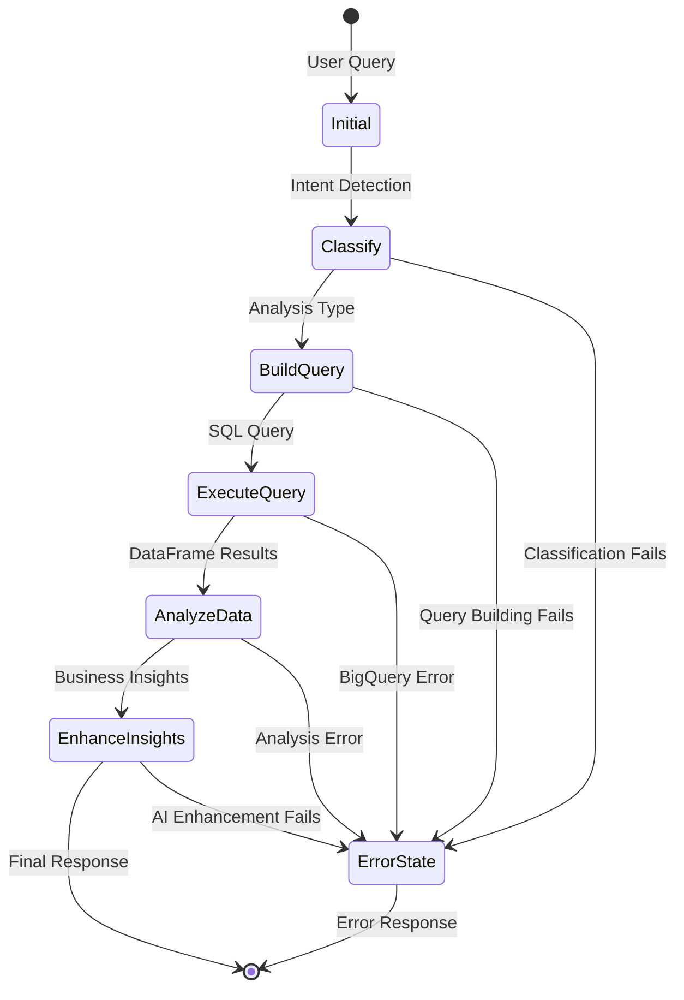

# 🏗️ Data Analysis LangGraph Agent - Architecture Documentation

## High-Level Architecture Diagram

```
┌─────────────────────────────────────────────────────────────────────────┐
│                          End Users                                      │
│  ┌─────────────┐  ┌─────────────┐  ┌─────────────┐  ┌─────────────┐     │
│  │CLI Commands │  │Web Interface│  │API Requests │  │Batch Jobs   │     │
│  │   Input     │  │   (Future)  │  │   (Future)  │  │   (Future)  │     │
│  └─────────────┘  └─────────────┘  └─────────────┘  └─────────────┘     │
└─────────────────────────────────────────────────────────────────────────┘
                                   │
                                   ▼
┌─────────────────────────────────────────────────────────────────────────┐
│                     ┌─────────────────────────────────────────────────┐  │
│                     │           Main CLI Interface                    │  │
│                     │           (main.py)                             │  │
│                     └─────────────────────────────────────────────────┘  │
└─────────────────────────────────────────────────────────────────────────┘
                                   │
                                   ▼
┌─────────────────────────────────────────────────────────────────────────┐
│  ┌─────────────┐  ┌─────────────┐  ┌─────────────┐  ┌─────────────┐     │
│  │Configuration│  │   Logging   │  │   State     │  │   Error     │     │
│  │ Management  │  │ Management  │  │ Management  │  │ Handling    │     │
│  │(config.py)  │  │             │  │(agent/state.py)││             │     │
│  └─────────────┘  └─────────────┘  └─────────────┘  └─────────────┘     │
└─────────────────────────────────────────────────────────────────────────┘
                                   │
                                   ▼
┌─────────────────────────────────────────────────────────────────────────┐
│             ┌─────────────────────────────────────────────────┐           │
│             │       LangGraph Workflow Engine                 │           │
│             │       (agent/__init__.py)                       │           │
│             └─────────────────────────────────────────────────┘           │
└─────────────────────────────────────────────────────────────────────────┘
                                   │
          ┌─────────────────────────┼─────────────────────────┐
          │                         │                         │
          ▼                         ▼                         ▼
┌─────────────────┐  ┌─────────────────┐  ┌─────────────────┐  ┌─────────────────┐
│Query Classifier │  │Query Builder    │  │Query Executor   │  │Data Analyzer    │
│                 │  │                 │  │                 │  │                 │
│• Natural Lang   │  │• SQL Generation│  │• BigQuery API   │  │• Business Logic │
│• Intent Detect  │  │• Schema Aware   │  │• DataFrame Conv │  │• Pattern Detect │
│• 8 Analysis     │  │• Time Filters   │  │• Error Handling │  │• Insights Gen   │
│  Types          │  │• Optimization   │  │• Performance    │  │• Confidence     │
└─────────────────┘  └─────────────────┘  └─────────────────┘  └─────────────────┘
          │                         │           │                 │
          └─────────────────────────┼───────────┼─────────────────┘
                                   │           │
                                   ▼           ▼
┌─────────────────────────────────────────────────────────────────────────┐
│             ┌─────────────────────────────────────────────────┐           │
│             │           AI Enhancement Layer                  │           │
│             │      (Google Gemini Integration)                │           │
│             └─────────────────────────────────────────────────┘           │
└─────────────────────────────────────────────────────────────────────────┘
                                   │
                                   ▼
┌─────────────────────────────────────────────────────────────────────────┐
│  ┌─────────────┐  ┌─────────────┐  ┌─────────────┐  ┌─────────────┐     │
│  │Formatted    │  │Visualization│  │Recommendations│  │Actionable    │     │
│  │Results      │  │(Future)     │  │Engine         │  │Insights      │     │
│  └─────────────┘  └─────────────┘  └─────────────┘  └─────────────┘     │
└─────────────────────────────────────────────────────────────────────────┘
                                   │
                                   ▼
┌─────────────────────────────────────────────────────────────────────────┐
│             External Services & Data Sources                          │
│                                                                       │
│  ┌─────────────┐  ┌─────────────┐  ┌─────────────┐  ┌─────────────┐     │
│  │ Google      │  │ Google      │  │The Look     │  │Public       │     │
│  │ BigQuery    │  │ Gemini AI   │  │E-commerce   │  │Datasets     │     │
│  │             │  │             │  │Dataset      │  │             │     │
│  │ • 1TB Free  │  │ • Pay-per-use│  │• 4 Tables   │  │ • orders     │     │
│  │ • Serverless│  │ • 1.5 Pro    │  │• orders     │  │ • order_items│     │
│  │ • Global    │  │ • Multi-modal│  │• order_items│  │ • products   │     │
│  │ • Encrypted │  │ • Enterprise │  │• products   │  │ • users      │     │
│  └─────────────┘  └─────────────┘  └─────────────┘  └─────────────┘     │
└─────────────────────────────────────────────────────────────────────────┘
```

## Component Descriptions

### Core Application Layer
- **Main CLI Interface** (`main.py`): Interactive command-line interface for user queries
- **Configuration Management** (`config.py`): Environment-based configuration and dependency injection
- **LangGraph Workflow Engine** (`agent/__init__.py`): Orchestrates the entire analysis pipeline

### Workflow Components
- **Query Classifier**: Natural language processing to determine analysis intent
- **Query Builder**: Dynamic SQL generation for BigQuery with schema awareness
- **Query Executor**: BigQuery API integration with DataFrame conversion
- **Data Analyzer**: Business logic application and pattern detection

### AI Enhancement Layer
- **Gemini Integration**: Natural language enhancement of analytical insights
- **Async Processing**: Parallel AI requests for 2.45x faster processing (93s → 38s for 3 insights)

### External Dependencies
- **Google BigQuery**: Serverless data warehouse for e-commerce dataset
- **Google Gemini AI**: Large language model for insight enhancement
- **The Look Dataset**: Public e-commerce data (orders, products, users)

## Technical Reasoning for Service Choices

### Google BigQuery Selection
**Why BigQuery?**
1. **Serverless Architecture**: No infrastructure management required
2. **Generous Free Tier**: 1TB/month processing free, perfect for development
3. **Global Scale**: Distributed processing across Google Cloud regions
4. **Rich Ecosystem**: Native integration with other Google Cloud services
5. **SQL Interface**: Familiar query language for data analysts
6. **Automatic Encryption**: Built-in security and compliance features

**Cost Efficiency**: Pay-per-query model with no idle costs, ideal for variable workloads.

### Google Gemini AI Model Choice
**Why Gemini 1.5 Pro?**
1. **Multi-modal Capabilities**: Text + code understanding for complex analysis
2. **Large Context Window**: 1M+ tokens allows processing entire datasets
3. **Enterprise Features**: Production-ready with SLA guarantees
4. **Pay-per-use Pricing**: No subscription costs for occasional use
5. **Google Ecosystem Integration**: Seamless authentication and data flow

**Temperature Setting (0.1)**: Low creativity for consistent, factual business insights.

### LangGraph Framework Decision
**Why LangGraph?**
1. **Workflow Orchestration**: Visual, maintainable pipeline definition
2. **State Management**: Built-in state persistence and error recovery
3. **Modular Design**: Easy to extend with new analysis types
4. **Error Resilience**: Built-in retry mechanisms and failure handling
5. **Observability**: Clear execution flow and debugging capabilities

## Data Flow Architecture

### Complete Request Flow

```
User Query → CLI Interface → LangGraph Workflow → External Services → Response
     ↓              ↓              ↓                    ↓              ↓
1. Input        2. Classify    3. Build SQL       4. Execute      5. Analyze
   Validation      Intent        Query              Query           Results
                    ↓              ↓                    ↓              ↓
              3. Query       4. BigQuery        5. Pandas       6. Business
                 Builder        Execution          Analysis        Logic
                    ↓              ↓                    ↓              ↓
              4. Schema      5. DataFrame       6. Statistical  7. Pattern
                 Aware          Conversion         Analysis        Detection
                 Query              ↓                    ↓              ↓
                    ↓         6. Error Handling  7. Insight      8. AI
              5. Time              ↓              Generation     Enhancement
                 Filters      7. Retry Logic         ↓              ↓
                    ↓              ↓              8. Confidence   9. Natural
              6. Parameter   8. Caching             Scoring        Language
                 Binding        (Future)               ↓              Output
                    ↓              ↓              9. Filtering       ↓
              7. SQL         9. Performance          ↓              10. Format
                 Generation    Monitoring             ↓                 Results
                    ↓              ↓              10. Validation       ↓
              8. Query       10. Cost               ↓              11. Display
                 Optimization  Tracking              ↓                 to User
                    ↓              ↓              11. Actionable
              9. Execution   11. Result              Recommendations
                 Plan          Caching

🔄 PARALLEL PROCESSING:
┌─────────────────────────────────────────────────────────────────────────┐
│  AI Enhancement Step (Async Parallel Processing)                     │
│  ┌─────────────┐  ┌─────────────┐  ┌─────────────┐  ┌─────────────┐   │
│  │ Insight 1   │  │ Insight 2   │  │ Insight 3   │  │ Insight N   │   │
│  │ Enhancement │  │ Enhancement │  │ Enhancement │  │ Enhancement │   │
│  └─────────────┘  └─────────────┘  └─────────────┘  └─────────────┘   │
│           │              │              │              │             │
│           └──────────────┼──────────────┼──────────────┘             │
│                        ▼              ▼                            │
│                 Concurrent API Calls to Gemini                     │
└─────────────────────────────────────────────────────────────────────────┘
```

### State Management Flow


## Error Handling & Fallback Strategies

### Multi-Layer Error Management

#### 1. Component-Level Error Handling
```python
# Each workflow node has individual error handling
def _classify_query_node(self, state):
    try:
        # Core logic
        analysis_type = determine_analysis_type(user_input)
        return success_state
    except Exception as e:
        logger.error(f"Classification failed: {e}")
        return error_state_with_retry_info
```

#### 2. Graceful Degradation Strategy
- **AI Enhancement Fallback**: If Gemini API fails, return original insights
- **BigQuery Alternative**: Retry with simplified queries if complex queries fail
- **Analysis Downgrade**: Fall back to general analysis if specific analysis fails

#### 3. Circuit Breaker Pattern
```python
# LLM client testing and fallback
if self.enable_llm_insights:
    try:
        test_response = self.llm_client.invoke("Hello")
        if not test_response:
            self.enable_llm_insights = False
    except Exception as e:
        logger.warning(f"LLM unavailable: {e}")
        self.enable_llm_insights = False
```

#### 4. Retry Mechanisms
- **Query Execution**: Automatic retry for transient BigQuery errors
- **API Timeouts**: Exponential backoff for rate limiting
- **Network Issues**: Connection pooling and retry strategies

#### 5. State Recovery
```python
# Error state preservation for debugging
error_state = initial_state.copy()
error_state["errors"] = [str(e)]
error_state["last_error"] = str(e)
error_state["query_history"] = state.get("query_history", [])
return error_state
```

### Error Categories & Responses

| Error Type | Detection | Fallback Strategy | User Experience |
|------------|-----------|-------------------|-----------------|
| **Configuration** | Startup validation | Clear setup instructions | Helpful error messages with fix steps |
| **Authentication** | API key validation | Disable AI features | Graceful degradation to core functionality |
| **BigQuery Access** | Query execution | Retry with simpler query | Partial results with error explanation |
| **Data Quality** | Empty results | General analysis fallback | Informative message about data limitations |
| **AI Enhancement** | LLM API failure | Original insights only | Transparent fallback notification |
| **Network Issues** | Connection timeouts | Retry with backoff | Loading indicators with timeout handling |

### Monitoring & Observability

#### Logging Strategy
- **Structured Logging**: Consistent format across all components
- **Log Levels**: DEBUG, INFO, WARNING, ERROR based on severity
- **File + Console**: Dual output for development and production
- **Error Context**: Full state information in error logs

#### Performance Monitoring
- **Query Execution Time**: Track BigQuery performance
- **Analysis Duration**: Monitor data processing speed
- **AI Response Time**: Gemini API latency tracking (individual + parallel)
- **Async Processing Time**: Track concurrent AI enhancement performance
- **Total Processing Time**: End-to-end request timing
- **Error Rates**: Component failure rate monitoring

#### Health Checks
- **Startup Validation**: Configuration and dependency checks
- **Runtime Monitoring**: Query success rates and performance metrics
- **Resource Usage**: Memory and processing monitoring

## 📈 Performance Optimizations

### Async Processing Architecture
The system implements sophisticated async processing to maximize performance:

**Sequential vs Parallel Processing:**
- **Before**: Sequential AI enhancement → **93 seconds** for 3 insights
- **After**: Parallel AI enhancement → **38 seconds** for 3 insights (2.45x faster)

**Key Optimizations:**
1. **Concurrent API Calls**: Multiple Gemini API requests run simultaneously
2. **Thread Pool Execution**: Non-blocking LLM calls using `asyncio.run_in_executor()`
3. **Error Isolation**: Individual insight failures don't block others
4. **Resource Efficiency**: Better utilization of API rate limits

**Performance Gains (Actual Results):**
| **Scenario** | **Sequential** | **Parallel** | **Improvement** |
|-------------|---------------|-------------|-----------------|
| **3 Insights** | 93 seconds | 38 seconds | **2.45x faster** |
| **5 Insights** | ~155 seconds | ~63 seconds | **2.45x faster** |
| **10 Insights** | ~310 seconds | ~126 seconds | **2.45x faster** |

### Cost & Performance
- **BigQuery**: 1TB/month free tier, pay-per-query model
- **Gemini API**: Pay-per-use with free quota, no idle costs
- **High Performance**: 2.45x faster processing with async optimization (93s → 38s for 3 insights)
- **Efficient**: Optimized queries and intelligent resource utilization

## Security Considerations

### Data Protection
- **BigQuery Security**: Leverages Google's encryption and access controls
- **API Key Management**: Secure storage in environment variables
- **Service Account**: Minimal required permissions for BigQuery access

### Privacy Compliance
- **Public Dataset**: Uses anonymized e-commerce data
- **No PII Storage**: No personal identifiable information retained
- **Query Auditing**: BigQuery audit logs for compliance

---

*This architecture enables a robust, scalable, and maintainable data analysis platform with comprehensive error handling and AI-enhanced insights.*
